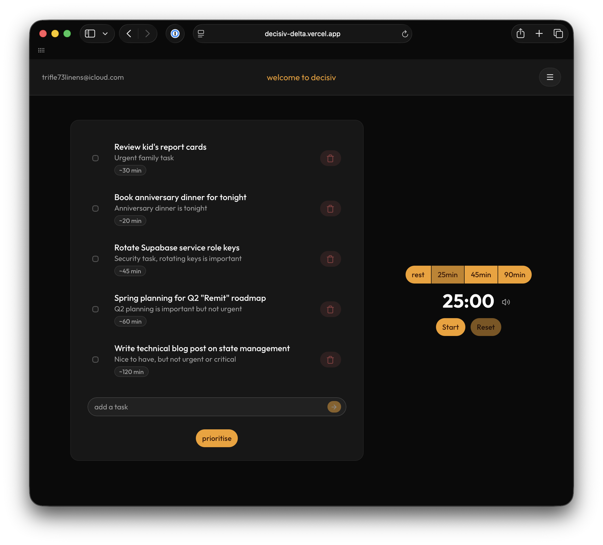

> "The to-do app is a rite of passage. I just wanted mine to be useful."

# Decisiv | AI-Prioritised Task Manager

Decisiv is a full-stack task management app that uses Meta's Llama 4 Maverick (17B) model to score and rank tasks by priority. Built originally as a learning project, the idea came from a real problem: a friend who produces music had dozens of small tasks piling up with no clear starting point. Decision paralysis is real, and sorting by deadline doesn't solve it. Decisiv lets users add personal context so the AI ranks tasks against their actual situation, not just the order they were entered.

---

## 🚀 Key Features

- **AI Prioritisation** – LLM scores each task and returns a ranked list with explanations, driven by a structured JSON prompt
- **Personal Context** – A settings page lets users describe their situation so rankings are personalised, not generic
- **Pomodoro Timer** – Built-in focus timer to pair with your prioritised task list
- **User Authentication** – Secure sign-up, login, and session management via Supabase Auth
- **Full Task Management** – Add, delete, and view tasks with real-time updates
- **Dark / Light Mode** – Theme toggle via next-themes
- **Performance** – Memoized server-side Supabase client and auth lookup to avoid duplicate requests on dashboard load

---

## 🛠️ Tech Stack

| Layer           | Technology                                |
| --------------- | ----------------------------------------- |
| Framework       | Next.js (App Router, Server Actions)      |
| Language        | TypeScript                                |
| UI              | React 19, shadcn/ui, Radix UI             |
| Styling         | Tailwind CSS                              |
| AI              | Meta Llama 4 Maverick (17B) via DeepInfra |
| Auth & Database | Supabase (PostgreSQL)                     |
| Deployment      | Vercel                                    |

---

## 🤕 Challenges Overcome

**Getting reliable structured output from the LLM**
The core challenge wasn't calling the API, rather it was making the output trustworthy. The model needed to return a consistently shaped JSON object with priority scores and explanations for each task. Getting that output shape reliable under varied inputs took real iteration on the prompt. I learned that prompt engineering is less about clever wording and more about constraint: the more precisely you define the contract, the less the model wanders.

**Running AI server-side via Server Actions**
Keeping LLM calls server-side was a deliberate decision. It keeps the API key out of the client and gives me a clean place to validate the response before it touches the UI. Wiring this up through Next.js Server Actions rather than a traditional API route was a useful exercise in understanding where logic actually belongs in the App Router model.

**Avoiding redundant auth requests**
The dashboard and task list both needed the authenticated user. Without caching, that meant duplicate Supabase round-trips on every load. I memoized the server-side client and user lookup so the auth call happens once per request cycle. A small change but I felt it has a noticeable impact on perceived load time.

---

## 💡 Lessons Learned

**Prompt engineering is interface design.**
Writing a prompt that reliably produces structured output taught me that the LLM is less a magic box and more a collaborator you have to be precise with. The same instinct that makes a good API contract — clear input, predictable output, explicit failure modes — applies directly to prompts.

**Server Actions change where you think about security.**
Having a first-class server-side primitive in Next.js made it natural to keep sensitive logic out of the client. It shifted my thinking from "how do I protect this API route" to "does this logic belong on the server in the first place."

---

## 📌 Status

decisiv is in active personal use. Planned improvements include task editing, priority history, and smarter context-weighting in the prompt.

Built by [Morgan Then](https://morganthen.vercel.app) · [LinkedIn](https://linkedin.com/in/morganthen) · [GitHub](https://github.com/morganthen)
